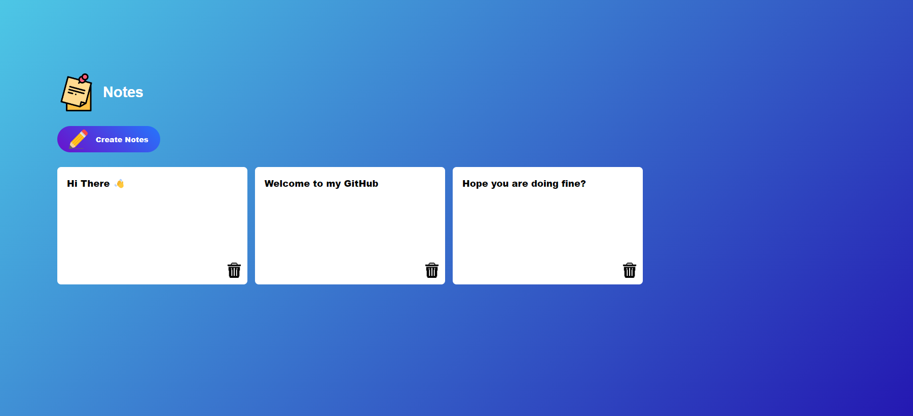

# Notes Application

This is a simple web-based notes application where you can create, edit, and delete notes. The application uses HTML, CSS, and JavaScript for the frontend, and localStorage for storing notes locally in the browser.

## Preview

## Features

- Create new notes with a customizable title and content.
- Edit existing notes directly in the browser.
- Delete notes individually.
- Automatically saves notes to localStorage, so they persist even after closing the browser.
- Simple and intuitive user interface.

## Usage

- **Create Note:** Click the "Create Note" button to create a new note. You can then type your note content directly into the text area.
- **Edit Note:** Click on the note content to edit it directly. Changes are saved automatically.
- **Delete Note:** Click the delete button (trash can icon) next to a note to delete it permanently.

## Technologies Used

- HTML
- CSS
- JavaScript

